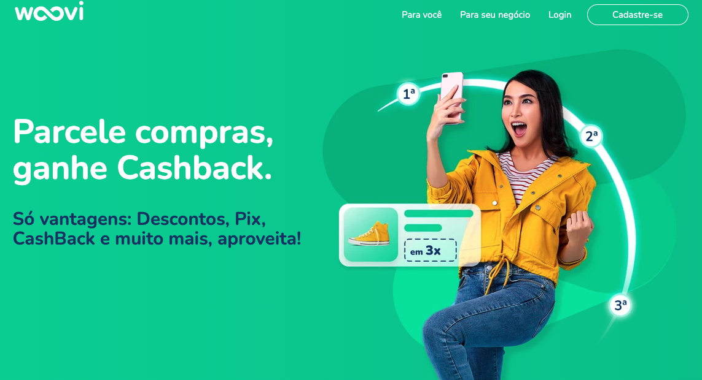
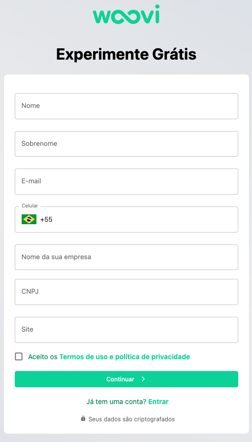
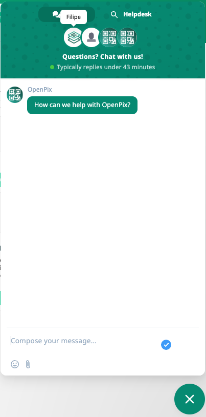
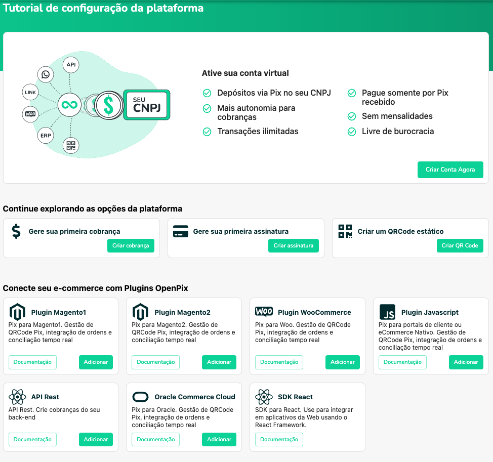
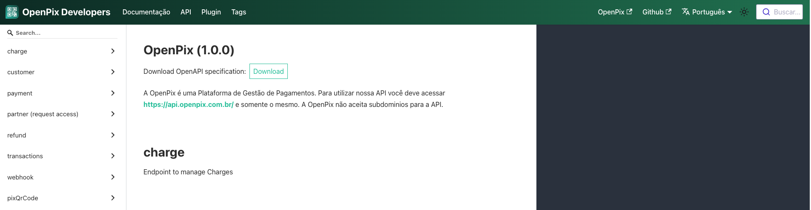
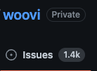
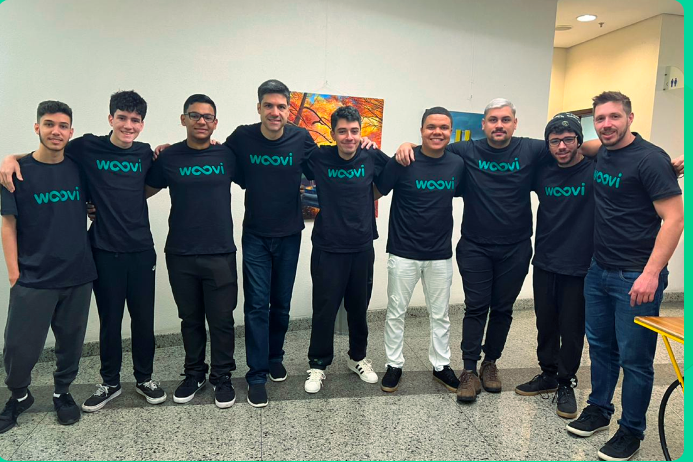
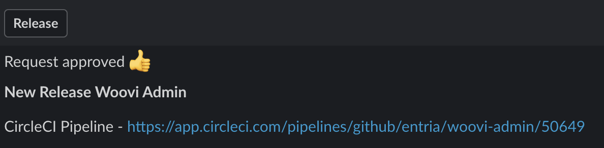
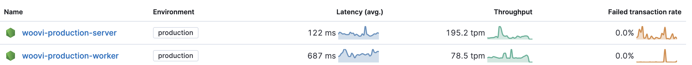
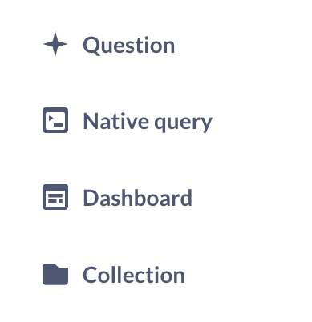

import { Head } from "mdx-deck";

import Cover from "./Cover";
import { Img } from "./Img";
import { Feedback } from "./Feedback";
import Thanks from './Thanks';
import Intro from './Intro';
import PixCashback from './PixCashback';

export { default as theme } from "./theme";

<Head>
  <link rel="preconnect" href="https://fonts.googleapis.com" />
  <link rel="preconnect" href="https://fonts.gstatic.com" crossorigin />
  <link
    href="https://fonts.googleapis.com/css2?family=Nunito:wght@400;500;700&display=swap"
    rel="stylesheet"
  />
  <link href="https://fonts.cdnfonts.com/css/cascadia-code" rel="stylesheet" />
  <link rel="apple-touch-icon" sizes="180x180" href="./img/apple-touch-icon.png" />
  <link rel="icon" type="image/png" sizes="32x32" href="./img/favicon-32x32.png" />
  <link rel="icon" type="image/png" sizes="16x16" href="./img/favicon-16x16.png" />
  <link rel="manifest" href="./img/site.webmanifest" />
  <meta name="msapplication-TileColor" content="#da532c" />
  <meta name="theme-color" content="#ffffff" />
  <title>Startup Ops - Operations</title>
</Head>

<Cover />

---

<Intro />

---

# Overview

<ul>
  <li>What is Operational Work?</li>
  <li>Landing Page</li>
  <li>Sales Automation</li>
  <li>Customer Success</li>
  <li>Onboarding</li>
  <li>Documentation</li>
  <li>Product Development</li>
  <li>Team Management</li>
  <li>Releases</li>
  <li>Monitoring</li>
  <li>Data Analysis</li>
</ul>

---

# What is Operational Work?

- It is the work that keeps the business running

---

# Landing Page

---

# Landing Page

- The landing page is the first impression on users
- It needs to be beautiful, simple and clear
- It needs to sell, you need a call to action
- It needs to tell your Startup story

---

# Landing Page - Operational Work

- Release Automation
- Design System to make it easy create new pages on Landing Page
- Write more articles and content to improve SEO
- Design of new pages

---

## Landing page - Woovi

- Articles in .mdx (no need for CMS yet, because our bottleneck is writing new content)
- Gatsby (we are going to migrate to nextjs in the future)
- Easy to create new pages and content - reuse design system components
- Cloudflare Pages for hosting

---

## Sales Automation

---

## Sales Automation

- Your Startup needs to sell something to be profitable
- Automating your sales process than decrease your Customer Acquisition Cost (CAC)
- Your users need to be able to try your product without talking to any sales person

---

## Sales Automation - Operational Work

- Make sure users registration process are working well
- Talk to new users to understand their needs

---

## Sales Automation - Woovi

- Our own user registration process
- Validate user email and mobile phone
- Sync new user to PipeDrive Sales CRM

---

## Customer Success

---

## Customer Success - Operational Work

- Make sure all customers are happy
- Talk to new customers to understand their needs
- Talk to existing customers to make sure they are still happy
- Notify customers of new features
- Notify customers of incidents
- Track customers issues and  feature requests

---

## Customer Success - Woovi

- Our support is chat based using [Crisp](https://crisp.chat/)
- We use [PipeDrive](https://www.pipedrive.com/) to add customer information
- We track internally customer issues and feature requests

---

## Onboarding

---

## Onboarding

- Onboarding is the process of helping new users to get started with your product
- It guides the user to use the platform and understand the value of your product
- It helps with integration
- It activates the user

---

## Onboarding - Operational Work

- Track if users are doing what they need to do
- Improve onboarding and documentation based on new users feedback
- Do integration call if needed

---

## Onboarding - Woovi

- Merchants need to open their virtual account
- Merchants need to connect OpenPix/Woovi to their e-commerce and brick and mortar stores
- Merchants need to start selling using OpenPix/Woovi
- Merchants need to withdraw they money

---

## Documentation

---

## Documentation

- Documentation is a way to communicate with your users
- Documentation reduces the number of support tickets
- The better the documentation, the more your users will use your product
- A public documentation can improve your Startup SEO

---

## Documentation - Operational Work

- Keeping your documentation up to date with your platform changes
- Improving documentation based on user feedback

---

## Documentation - Woovi

- [https://developers.openpix.com.br/](https://developers.openpix.com.br/) - Technical Documentation
- [https://ajuda.openpix.com.br/](https://ajuda.openpix.com.br/) - Non-Technical Documentation

---

## Product Development

---

## Product Development - Operational Work

- make sure everybody is working on the most important things
- repriority tasks based on new information
- create building blocks/abstraction to move faster

---

## Product Development - Woovi

- We have 6 products in our Roadmap
- We have 4 of them in production: Pix, Cashback, Giftback, Offline/PDV
- We focus on features/products that makes us reach our OKR - Objectives and Key Results.

---

## Team Management

---

## Team Management

- Your team will build your Product
- Your team will build your Startup culture
- Your team are still learning a lot
- Your team needs training and support

---

## Team Management - Operational Work

- Delegation
- Communication
- 1 a 1
- Checking how each member of the team is doing
- Unblocking the team
- Making sure they are happy and challenged
- Reviewing everything they do

---

## Team Management - Woovi

- Team contribute with their own ideas
- Teams are autonomous and take their own decisions

---

## Releases

---

## Releases

- Releases make sure our users see the working we have done

---

## Releases - Operational Work

- Test everything that will be released
- Ask for help from team members if needed

---

## Releases - Woovi

- All release process is automated
- We have a Slack bot to publish a new release
- Any team member can publish a new release
- Many releases per day

---

## Monitoring

---

## Monitoring

- Monitoring helps us understand how our system are working in production
- Monitoring help us understand how the users are using our product

---

## Monitoring - Operational Work

- Check if there is performance regression after a release
- Check if there are new errors after a release
- Check if how a new feature is being used

---

## Monitoring - Woovi

- Kibana + Elastic APM (Application Performance Monitoring) for server monitoring
- Sentry for error monitoring
- Slack for alerts
- Google Analytics for user behavior

---

## Data Analysis

---

## Data Analysis

- Data Analysis helps us understand how our business is doing
- Ask questions and find answers for our questions

---

## Data Analysis - Operational Work

- Build dashboards to help us understand our business
- Review existing dashboards and reports to make sure they are still relevant
- Review data modeling to improve our data analysis

---

## Data Analysis - Woovi

- We use [Metabase](https://www.metabase.com/) to build dashboards
- We track our revenue, profit and expenses in realtime
- We track Daily Activy Users (DAO) and Monthly Activity Users (MAU)
- We track customer retetion and cohort
- We track how our users are growing.
- We have specific KPIs (Key Performance Indicators) for each product.

---

<PixCashback />

---

<Thanks />
